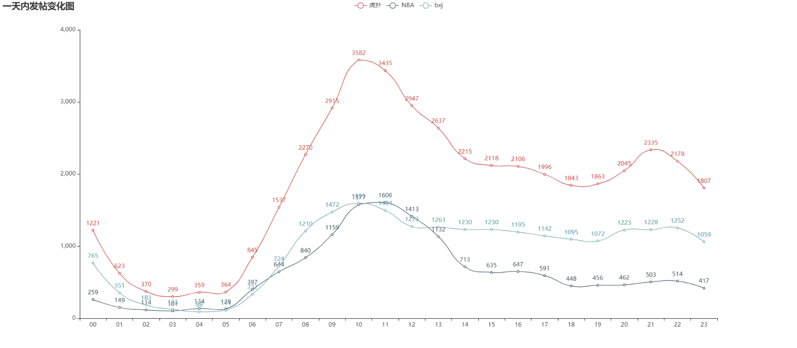
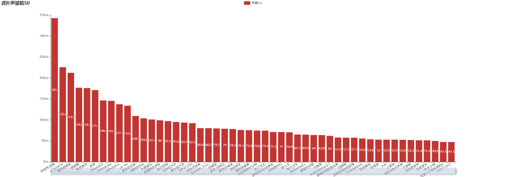
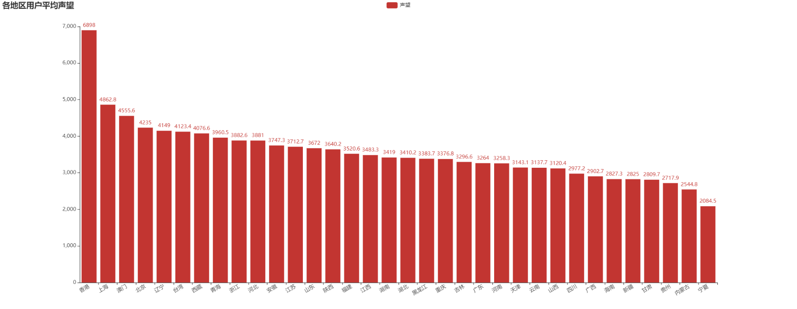

# 2019年3月-6月虎扑发帖数据分析
## 动态效果展示
* 动态图表演示地址：<https://htmlpreview.github.io/?https://raw.githubusercontent.com/spiderbeg/hupu_data/master/hupu_html/one_piece_plates.html> （第一次加载时可能有点慢，注意：不要频繁点刷新，一般等待一段时间就会出来）
* 更多实用而有趣的分析案例请关注：*Crossin的编程教室*
## 项目内容
* 抓取虎扑2019年**3月16日至6月23日**帖子标题、回帖数、浏览数，发布时间；并选取 **top 4.4w** 帖子抓取**亮了的回帖内容**；及相关的**用户信息**，包括所在地、性别、等级 、注册时间、在线时长、声望、回帖数、主题数；
* 绘制图像包括：
  1. 近三月的发帖、回帖变化，及24小时的发帖、回帖变化；
  2. 回帖数与浏览数、回帖数与主题数、注册时长与在线时长；
  3. 虎扑各板块发帖量占比、虎扑性别分布、各板块回帖占比、使用设备占比；
  4. 各地区用户平均在线时长、平均声望、平均发帖数、平均回帖数、注册年份分布；
  5. 发帖，回帖内容词云。
## 项目思路
1. 分析虎扑论坛页面，评价可获取数据，确定分析目标；
2. 使用 requests 或者 scrapy 抓取相应数据（本项目使用 scrapy 及 requests）, 并使用 pymongo 保存；
3. 使用可视化工具 pyecharts，对数据进行可视化处理。
4. 整理分析。
## 运行环境
* python3.7
* windows
* jupyter notebook
## 运行依赖包
* requests
* pyecharts
* pymongo
* scrapy
* jieba
* wordcloud
## 文件说明
### hupu_html
* 使用 pyecharts 生成图像的文件，具有很好的交互性，建议下载到本地查看；同时本项目考虑图表交互性，图使用 pyecharts 绘制。推荐使用 jupyter notebook 作图。
### hupu_pic
* pyecharts 图表为 html 文件，为方便在 GitHub 上查看部分效果，此文件夹为**hupu_html**中图像的展示及发帖、回帖内容词云。
### code
* **hupu** 文件夹中为本次使用的 scrapy 项目文件，包括抓取用户信息，及详细帖子的代码；
* plates_list.py 爬取各板块发帖列表的基础信息；
* classify.json MongoDB 中表 classify 的数据；
* jieba2.txt 和 stop2.txt 内容分词文件；
* pyecharts_hupu.ipynb jupyter notebook 文件包括 **hupu_html** 文件夹中文件的生成代码一个 html 生成单张的图; hupu_pyecharts.ipynb 一个 html 文件生成多张图, hupu_html 文件中配置的为 hupu_pyecharts.ipynb 的实现。
## 一些代码说明及建议
### 如何跑起来
1. 在你想要放置本项目的文件夹下使用

        git clone https://github.com/spiderbeg/hupu_data.git
    
   将本项目复制文件夹中。

2. 首先运行爬虫代码 **plates_list.py**, 代码中的 classfy 表文件，我将以 json 文件提供，可直接导入 MongoDB；板块信息抓取完毕，接下来根据标准选择自己需求范围的数据，本次项目需求是 抓取回帖 200 以上或浏览 5w 以上的帖子进行分析；获得抓取帖子的代码如下：

        import pymongo
        def get_ready(ch='plates',dbname='hupu'):
            '''数据库调用'''
            global mycol, myclient,myhp
            myclient = pymongo.MongoClient("mongodb://localhost:27017/")
            mydb = myclient[dbname]
            mycol = mydb[ch]
            myhp = mydb['posts_list']
        get_ready()
        ss = mycol.find({})
        reply = [0]
        r,v = 0,0
        for i,s in enumerate(ss): 
            if int(s['reply'])>=200 or int(s['view'])>=50000:
                s.pop('_id')
                myhp.insert_one(s)
            
3. 进入 code 文件夹下 **hupu** 的 scrapy 项目。

        scrapy crawl hupu_p_c 
    
   这就是抓取帖子详细内容的爬虫。

        scrapy crawl user
    
   这是抓取用户信息的代码。
4. 绘图代码，放在 code 的 **pyecharts_hupu.ipynb**；
这样整个项目就跑了起来。
### 对于如何跑起来中有疑问的地方，这里回答
* 导入json格式文件数据： mongoimport -d <数据库名称> -c <collection名称> --file <要导入的json文件名称>
* 如何安装 git 见 <https://mp.weixin.qq.com/mp/appmsg/show?__biz=MjM5MDEyMDk4Mw==&appmsgid=10000361&itemidx=1&sign=f88b420f70c30c106697f54f00cf2a95>；
* MongoDB 安装：<http://mongoing.com/archives/25650> ；使用：<https://juejin.im/post/5addbd0e518825671f2f62ee>;
* 不熟悉 scrapy 的瞧一眼这里：<https://cuiqingcai.com/3472.html>;
### 部分代码示例
* 连接 MongoDB:

        def get_ready(ch='reply_user',dbname='hupu'): # ch: 表名，dbname: 数据库名
            '''数据库调用'''
            global mycol, myclient,myhp
            myclient = pymongo.MongoClient("mongodb://localhost:27017/")
            mydb = myclient[dbname]
            mycol = mydb[ch]
            myhp = mydb['posts_user']
 
* scrapy 保存数据到数据库 piplines.py; 以下为官方示例<https://scrapy-chs.readthedocs.io/zh_CN/1.0/topics/item-pipeline.html>，本项目已经配好请直接使用：

        import pymongo

        class MongoPipeline(object):

            collection_name = 'scrapy_items' # 爬虫名

            def __init__(self, mongo_uri, mongo_db): # 初始化参数
                self.mongo_uri = mongo_uri
                self.mongo_db = mongo_db

            @classmethod
            def from_crawler(cls, crawler):
                return cls(
                    mongo_uri=crawler.settings.get('MONGO_URI'),
                    mongo_db=crawler.settings.get('MONGO_DATABASE', 'items')
                )

            def open_spider(self, spider): # 爬虫开启时调用
                self.client = pymongo.MongoClient(self.mongo_uri)
                self.db = self.client[self.mongo_db]

            def close_spider(self, spider): # 爬虫关闭时调用
                self.client.close()

            def process_item(self, item, spider): # 每个item pipeline组件都需要调用该方法，这个方法必须返回一个具有数据的dict，或是 Item (或任
                self.db[self.collection_name].insert(dict(item)) # 何继承类)对象， 或是抛出 DropItem 异常，被丢弃的item将不会被之后的
                return item                                      # pipeline组件所处理。
   
* pyecharts 绘制饼图：

        # 性别占比---------------------top 5w---------------------
        from pyecharts import options as opts
        from pyecharts.charts import Page, Pie
        def pie_radius() -> Pie:
            vl = [165067, 127661, 6171]
            attr = ["保密", "男", "女"]
            c = (
                Pie()
                .add(
                    "",
                    [list(z) for z in zip(attr, vl)],
                    radius=["40%", "75%"],
                )
                .set_global_opts(
                    title_opts=opts.TitleOpts(title="虎扑用户性别占比", subtitle='男：女 = 20.7：1' ),
                    toolbox_opts=opts.ToolboxOpts(), # 数据展示
                    legend_opts=opts.LegendOpts(
                        orient="vertical", pos_top="15%", pos_left="2%"
                    ),
                )
                .set_series_opts(label_opts=opts.LabelOpts(formatter="{b}: {c}"))
                .render('C:\\Users\\yc\\Desktop\\user_sex_proportion.html')
            )
            return c
        pie_radius()

* 结巴分词，想了解更多的看这里官网地址<https://github.com/fxsjy/jieba>

        import jieba.analyse
        import jieba

        # 数据生成---------------------------
        jieba.load_userdict(r'C:\Users\yc\Desktop\jieba2.txt')
        jieba.analyse.set_stop_words(r'C:\Users\yc\Desktop\stop2.txt') 
        with open(r'C:\Users\yc\Desktop\hupu_post.txt', 'rb' ) as f: # 生成的发帖文本
            sentence = f.read()
        a = jieba.analyse.extract_tags(sentence, topK=200, withWeight=True) # sentence：内容，topK：返回分词的个数，withWeight：返回权重

* 词云生成：

        import jieba.analyse
        from wordcloud import WordCloud, ImageColorGenerator
        import matplotlib.pyplot as plt
        import numpy as np
        from scipy.misc import imread

        b = {}
        for i,j in a:
            b[i] = j
        print(i,j)

        # wordcloud 部分设置
        font_path = r'C:\Users\yc\Desktop\SIMFANG.ttf' # 字体 # wordcloud设置
        back_coloring = imread(r'C:\Users\yc\Desktop\get.png')  # 设置背景图片

        # 设置词云属性
        wc = WordCloud(font_path=font_path,  # 设置字体
                       background_color="white", max_words=2000, mask=back_coloring,
                       max_font_size=100, random_state=4, width=1000, height=860, margin=2,
        #                contour_width=1, contour_color='black',
                       )
        # 根据频率生成词云
        wc.generate_from_frequencies(b)
        # create coloring from image
        image_colors_default = ImageColorGenerator(back_coloring)

        # 显示图片
        plt.figure()
        # plt.imshow(wc.recolor(color_func=image_colors_default), interpolation="bilinear")
        plt.imshow(wc,interpolation="bilinear")
        plt.axis("off")
        plt.show()
        wc.to_file(r'C:\Users\yc\Desktop\get_to1.jpg') # 保存文件

### pyecharts_hupu.ipynb 中出现的 MongoDB 表名解释
* classify 虎扑板块分类信息，在 **code** 文件夹下提供 classify.json MongoDB 中表 classify 的数据；
* plates 抓取到的板块贴子信息，包括帖子名、发布时间、浏览、回复数等；
* posts_detail 帖子的详细信息，包括帖子内容及回帖内容等信息；
* posts_user 和 reply_user 根据需求抓取的帖子中的用户信息。
### 建议
* 为了方便大家观看 **hupu_html** 中的效果,所需的 js 文件,也放置在文件夹中,还保持 hupu_html 文件夹完整,以便查看效果;
* 考虑绘制图表的交互性，推荐使用 pyecharts <https://pyecharts.org/>；
* 项目中涉及路径的地方需修改为自己需要放置的路径.
## 部分图片展示（更多图片见 hupu_html 及 hupu_pic 文件）
* 虎扑各板块发帖占比图
 
* 虎扑性别占比图
 
* 虎扑24小时发帖变化图
 
* 虎扑声望前50图
 
* 虎扑各地区用户平均声望图
 
* 虎扑回帖词云
 
* 更多实用而有趣的分析案例请关注：*Crossin的编程教室* 
 
